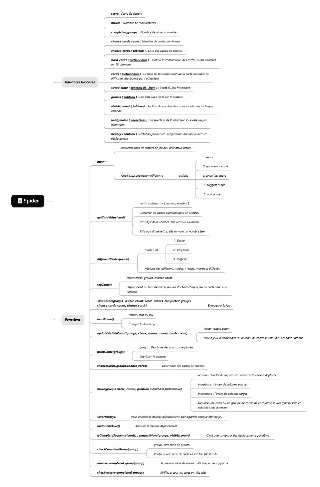

# Le jeu de Spider (Spider game)
## Resume
C'est un jeu du Spider en mode texte.
## Les structures de données utilisées
J’utilise principalement le dictionnaire et le tableau. Le dictionnaire a pour tâche de faciliter la création des cartes. Je utilise la couleur comme clé et le nombre comme valeur. L'utilisation de listes permet de retrouver rapidement chaque colonne et chaque carte.
## Les commandes de jeu / les menus
Au début :  

⏰A saved game was found. Would you like to load it? (yes/no): no  

🆕Starting a new game.  

👾Please input the number to choix the game mode: 1->easy ; 2->medium ; 3->hard 3  

( imprimer le plateau )  

🃏Current number of cards on the table: 54  

👉The current score: 500  
🔢The current moves: 0  
🎯Completed groups: 0  
🍀Number of remaining chance cards: 50  
🃏please input your action: 1: move; 2: get chance cards; 3: undo last move; 4: suggest move; 5: quit game  

## Les fonctions et variables

